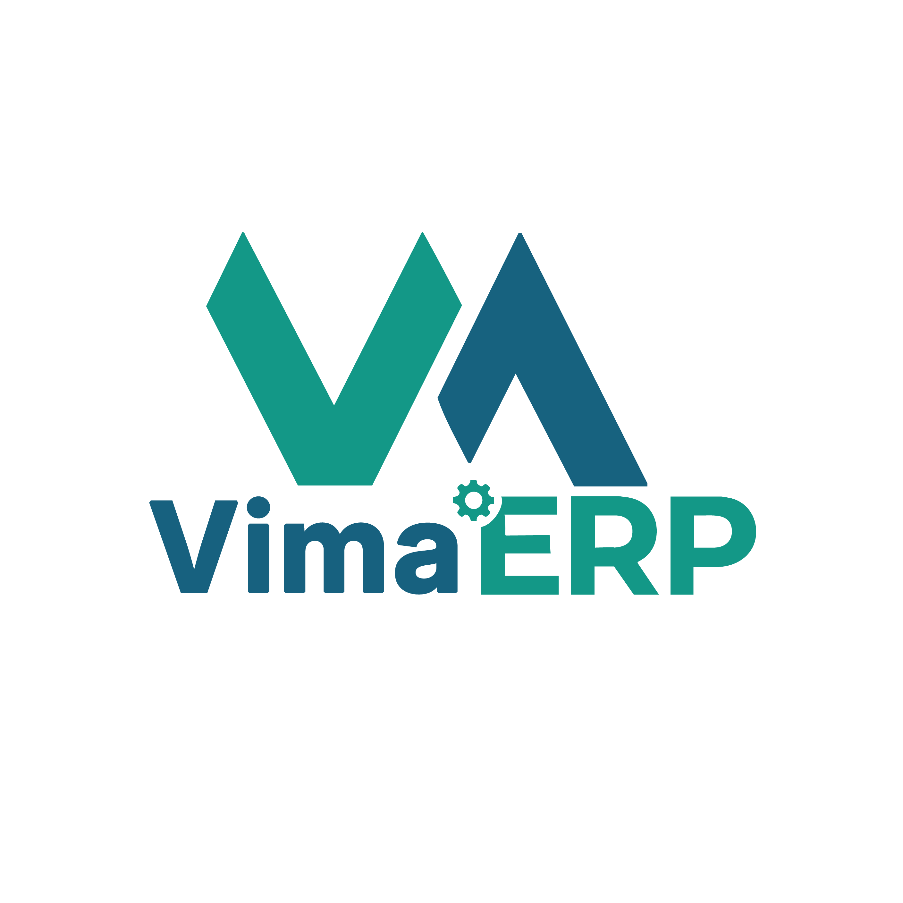

🚀 VimaERP 2.0 (Python + React)
===============================

O **VimaERP** é um sistema SaaS de Gestão Empresarial (ERP) e PDV ágil e moderno, reescrito com uma stack orientada a alta concorrência e User Experience.

🛠️ Stack Tecnológica
---------------------

* **Backend:** Python 3.12+, FastAPI, Uvicorn.

* **Arquitetura:** MVCS (Model-View-Controller-Service) com Padrão **Active Record** sobre SQLAlchemy 2.0.

* **Banco de Dados:** PostgreSQL (com Alembic para Migrations).

* **Assincronismo:** Celery + Redis (Task Queues para Webhooks e Notas Fiscais).

* **Frontend:** React 18, Vite, Tailwind CSS, Shadcn/UI, TanStack Query.

✨ Principais Diferenciais
-------------------------

* **PDV SPA Ultra-Rápido:** Frontend em React isolado do ciclo de requisições lentas. O Caixa não trava nunca.

* **Isolamento Contextual:** Gerenciamento multi-filial seguro através de ContextVars do Python e extração via JWT/Headers.

* **Active Record no Python:** Produtividade incomparável no backend. Escreva produto.save() sem gerar boilerplates ou repositórios pesados.

* **Omnichannel Otimizado:** Disparos de Evolution API e Integrações com Asaas ocorrem 100% em non-blocking I/O.

⚙️ Requisitos do Ambiente
-------------------------

* Docker & Docker Compose (Para Postgres, Redis e Celery)

* Python 3.12+ (Para o Backend FastAPI)

* Node.js 20+ & NPM/Yarn (Para o Frontend React)

📦 Instalação (Ambiente Local)
------------------------------

1. Clone o repositório:git clone <https://github.com/reisdiegoss/vimaerp.git>

2. **Suba as dependências via Docker:**docker-compose up -d db redis

3. **Backend Setup:**cd backendpython -m venv venvsource venv/bin/activate (no Windows: venv\\Scripts\\activate)pip install -r requirements.txtalembic upgrade headuvicorn app.main:app --reload

4. **Frontend Setup:**cd frontendnpm installnpm run dev

Sua API estará em <http://localhost:8000> (e Swagger em /docs) e o Frontend em <http://localhost:5173>.
